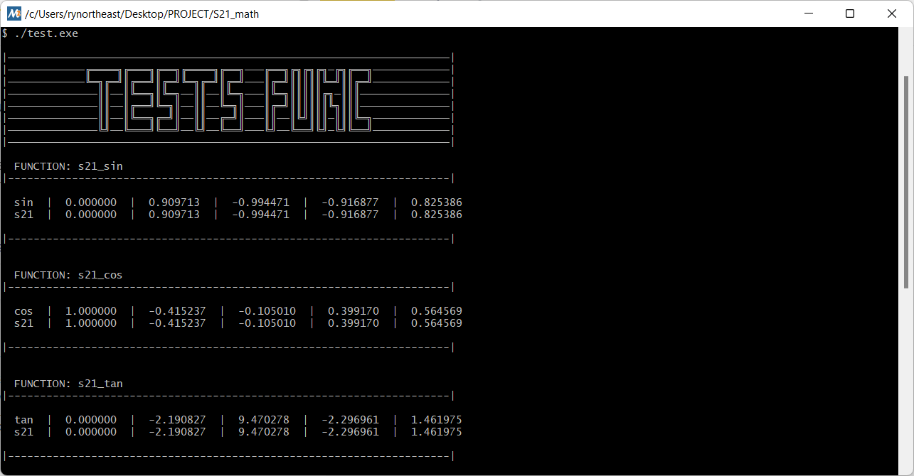

# S21_math

## Table of contents
* [About](#about)
* [Goal & requirements](#goal--requirements)
* [Key learnings](#key-learnings)
* [Building](#building)
* [Overview of implemented functions](#overview-of-implemented-functions)
* [Credits](#credits)

## About 

Implementation of some libc `math.h` functions with at least 1e-6 precision.

## Goal & requirements 

The goal of this project has to understand how the main mathematical functions are implemented in computer using C language. In the course of the work, it was necessary to study and analyze various methods to achieve desired accuracy. One of these methods was Taylor series.

## Key learnings

- Some interesting math algos (Newton method, Taylor series, etc.)
- Working with floats (precision, role of EPS, etc.)
- Trigonometry, their optimization formulas
- Taylor series

## Overview of implemented functions

| No. | Function | Description | Status |
| --- | -------- | ----------- | ------ |
| 1 | `int abs(int x)` | computes absolute value of an integer value | 🔜 |
| 2 | `long double acos(double x)` | computes arc cosine | ✅ |
| 3 | `long double asin(double x)` | computes arc sine | ✅ |
| 4 | `long double atan(double x)` | computes arc tangent | ✅ |
| 5 | `long double ceil(double x)` | returns the nearest integer not less than the given value | 🔜 |
| 6 | `long double cos(double x)` | computes cosine | ✅ |
| 7 | `long double exp(double x)` | returns e raised to the given power | 🔜 |
| 8 | `long double fabs(double x)` | computes absolute value of a floating-point value | 🔜 |
| 9 | `long double floor(double x)` | returns the nearest integer not greater than the given value | 🔜 |
| 10 | `long double fmod(double x, double y)` | remainder of the floating-point division operation | 🔜 |
| 11 | `long double log(double x)` | computes natural logarithm | 🔜 |
| 12 | `long double pow(double base, double exp)` | raises a number to the given power | 🔜 |
| 13 | `long double sin(double x)` | computes sine | ✅ |
| 14 | `long double sqrt(double x)` | computes square root | 🔜 |
| 15 | `long double tan(double x)` | computes tangent | ✅ |

## Building

1. Clone this repository via
    - SSH `git@github.com:rynortheast/S21_math.git` or
    - HTTPS `https://github.com/rynortheast/S21_math.git`
2. Change code base if necessary
3. Run `make test` to build project and run tests
3. Run `make s21_math` to build a static lib

## Credits

- Developer: [RV-304 (@rynortheast)](https://github.com/rynortheast)
- 21-SCHOOL for providing this task as a part of our curriculum ✌️🔥
